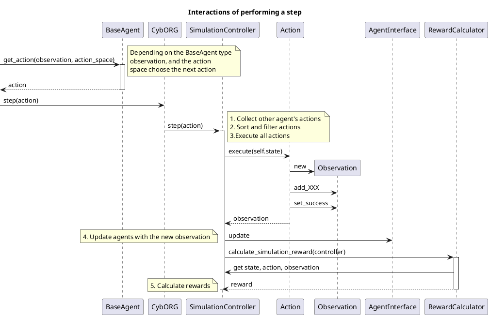

# About
This file will contain an overview of CybORG architecture. There are great tutorials, but it feels that a big picture can be presented better.

```puml
@startuml
title CybORG Architecture

abstract class BaseAgent {
  +get_action(observation, action_space): Action
}

abstract class Action {
  +execute(state: State): Result
}

class ExploitRemoteService #red
class DiscoverRemoteSystems #red
class DiscoverNetworkServices #red
class PrivilegeEscalate #red
class Impact #red
class Analyse #blue
class Misinform #blue{
    DecoyFactory decoys[]
}
class Monitor #blue
class Remove #blue
class Restore #blue
class Sleep
class GreenPingSweep #green
class GreenPortScan #green
class GreenConnection #green

Misinform o-- DecoyFactory

class EscalateAction
class JuicyPotato

EscalateAction <|-- JuicyPotato
EscalateAction <|-- V4L2KernelExploit

note bottom of JuicyPotato: Windows only
note bottom of V4L2KernelExploit: Linux only

PrivilegeEscalate o-- EscalateAction : selects

class ExploitAction
class BlueKeep
class EternalBlue
class HTTPRFI
class HTTPSRFI
class SSHBruteForce
class FTPDirectoryTraversal
class SQLInjection
class HarakaRCE

ExploitRemoteService  o-- ExploitAction  : selects
ExploitAction <|-- BlueKeep
ExploitAction <|-- EternalBlue
ExploitAction <|-- HTTPRFI
ExploitAction <|-- HTTPSRFI
ExploitAction <|-- SSHBruteForce
ExploitAction <|-- FTPDirectoryTraversal
ExploitAction <|-- SQLInjection
ExploitAction <|-- HarakaRCE

class StopProcess

class BlueReactRemoveAgent #blue
class BlueReactRestoreAgent #blue
class BlueLoadAgent #blue
class CounterKillchainAgent #blue
class ConstantAgent
class SleepAgent
class MonitorAgent
class KeyboardAgent
class RandomAgent
class TestFlatFixedAgent
class GreenAgent #green
class B_lineAgent #red
class KillchainAgent #red
class HeuristicRed #red
class RedMeanderAgent #red

BaseAgent <|-- BlueReactRemoveAgent #blue
BaseAgent <|-- BlueReactRestoreAgent #blue
BaseAgent <|-- BlueLoadAgent #blue
BaseAgent <|-- CounterKillchainAgent #blue
BaseAgent <|-- ConstantAgent
BaseAgent <|-- SleepAgent
BaseAgent <|-- MonitorAgent
BaseAgent <|-- KeyboardAgent
BaseAgent <|-- RandomAgent
BaseAgent <|-- TestFlatFixedAgent
BaseAgent <|-- GreenAgent #green
BaseAgent <|-- B_lineAgent #red
BaseAgent <|-- KillchainAgent #red
BaseAgent <|-- HeuristicRed #red
BaseAgent <|-- RedMeanderAgent #red


class RewardCalculator
abstract class EnvironmentController {
  RewardCalculator team_reward_calculators{}
  +step(agent_id: str, action: Action): Observation, Reward
  +reset(): Observation
  +get_observation(agent: str) -> Observation
}
EnvironmentController o-- RewardCalculator


class Session{
    hostname
    username
    agent
    pid
    session_type
}

class RedAbstractSession
class GreenAbstractSession
class VelociraptorServer

class Process{
    name
    pid
    ppid
    program
    user
    path
    open_ports
    decoy_type
    connections[]
    properties[]
}

class File

class Host {
    Process processes[]
    os_type
    version
    kernel
    patches
    hostname
    host_type
    users
    File files[]   
}


class State{
    Host hosts{}
    Session sessions{}
    Subnet subnets{}
}

note right of State::sessions
    Maps agent names to mapping of session id to session objects
end note

note top of State
    This class contains all the data 
    for the simulated network, 
    including ips, subnets, 
    hosts and sessions.
end note

class SimulationController{
    State state
}

class CybORG {
  EnvironmentController environment_controller  
  +step(agent_id: str, action: Action): Observation, Reward
  +reset(): Observation
  +get_observation(agent: str) -> Observation
}


note top of BaseAgent
  Represents an actor interacting with the environment.
  Different agents can have different capabilities 
  and levels of access to the environment.
end note

note top of CybORG
  Represents the cybersecurity simulation environment.
  The environment is responsible for maintaining the 
  state of the simulation and applying the actions 
  performed by the agents.
end note

note top of Action
  Represents an action performed by an agent.
  An action can change the state of the environment 
  and/or give the agent a reward.
end note


Action <|-- ExploitRemoteService
Action <|-- DiscoverRemoteSystems
Action <|-- DiscoverNetworkServices
Action <|-- PrivilegeEscalate
Action <|-- Impact
Action <|-- Analyse
Action <|-- Misinform
Action <|-- Monitor
Action <|-- Remove
Action <|-- Restore
Action <|-- Sleep
Action <|--  GreenPingSweep
Action <|--  GreenPortScan
Action <|--  GreenConnection

Session <|-- RedAbstractSession
Session <|-- GreenAbstractSession
Session <|-- VelociraptorServer

Remove -> StopProcess : uses

BaseAgent --> Action : Performs
Action --> CybORG : Changes
CybORG --> BaseAgent : Provides feedback
CybORG *-- EnvironmentController
EnvironmentController <|-- SimulationController
SimulationController *-- State
State *-- Host
State *-- Session
Host *-- Process
Host *-- File

abstract class BaseWrapper{

    +step
    +reset
    +observation_change
    +action_space_change
    +get_action_space
    +get_observation
}

class EnumActionWrapper
class FixedFlatWrapper

abstract class OpenAI.Env{
    +step
    +reset
    +render
    +close
    +seed
}

class OpenAIGymWrapper{
}

note top of BaseWrapper
    Wraps the CybORG and 
    provides and API to transforms its
    action and observation space into vectors 
end note

note top of EnumActionWrapper
    Transforms the action space
end note

note top of FixedFlatWrapper
    Transforms the observation into a huge vector
end note

BaseWrapper <|-- EnumActionWrapper
BaseWrapper <|-- FixedFlatWrapper
BaseWrapper <|-- OpenAIGymWrapper
OpenAI.Env <|-- OpenAIGymWrapper

@enduml
```

```puml
@startuml
title Interactions of performing a step
participant BaseAgent
-> BaseAgent : get_action(observation, action_space)
activate BaseAgent
note left: Depending on the BaseAgent type \nobservation, and the action \nspace choose the next action
<-- BaseAgent : action
deactivate BaseAgent
-> CybORG : step(action)
CybORG -> SimulationController : step(action)
activate SimulationController
note right: 1. Collect other agent's actions \n2. Sort and filter actions \n3.Execute all actions
SimulationController -> Action : execute(self.state)
create Observation
Action -> Observation : new
Action -> Observation : add_XXX
Action -> Observation : set_success
Action --> SimulationController : observation
SimulationController -> AgentInterface : update
note left: 4. Update agents with the new observation
SimulationController -> RewardCalculator : calculate_simulation_reward(controller)
activate RewardCalculator
RewardCalculator -> SimulationController : get state, action, observation
RewardCalculator --> SimulationController : reward
deactivate RewardCalculator
note left: 5. Calculate rewards
deactivate SimulationController
@enduml
```
